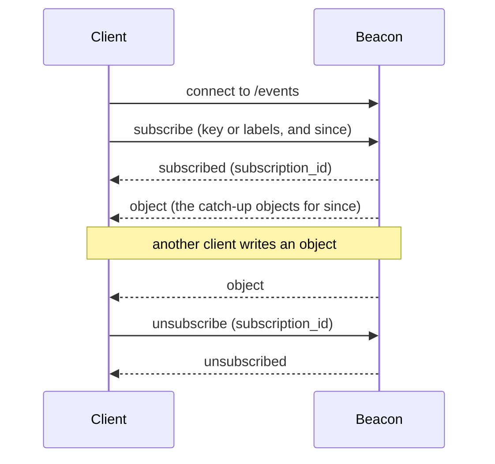

# API Reference

Base URL: `http://host:port`. WebSocket URL: `ws://host:port/events`.

All messages use JSON. Beacon has no authentication. Run it on a trusted network.

## The object

Every endpoint returns an object with these five fields:

```json
{
  "key": "server/1",
  "timestamp": 1787502981792,
  "value": "ready",
  "labels": { "group": "web", "region": "india" },
  "deleted": false
}
```

| Field | Type | Description |
| --- | --- | --- |
| `key` | string | The identifier. Slashes are allowed. |
| `timestamp` | integer | The time of the last change, in Unix milliseconds. |
| `value` | string or null | A value that Beacon does not read. `null` in a tombstone. |
| `labels` | object | String-to-string pairs. |
| `deleted` | boolean | `true` in a tombstone. |

## HTTP

| Method and path | Purpose |
| --- | --- |
| `PUT /objects/{key}` | Write or replace one object. |
| `GET /objects/{key}` | Read one object. |
| `DELETE /objects/{key}` | Make a tombstone. |
| `GET /objects` | List objects with filters and pages. |

### PUT /objects/{key}

Request body:

```json
{ "value": "ready", "labels": { "group": "web" } }
```

- `value` is necessary. It must be a string. `null` gives a `422`.
- `labels` is optional. The default is `{}`. All names and all values must be strings.

A `PUT` replaces both the value and the labels. Beacon does not keep the old labels. To keep a label, send it again.

The response is `200` with the new object.

### GET /objects/{key}

| Status | Condition |
| --- | --- |
| `200` | The object exists. A tombstone also gives `200`. |
| `404` | The key never existed, or the cleanup task removed the tombstone. |

### DELETE /objects/{key}

A `DELETE` makes a tombstone. It keeps the labels of the object, and sets `value` to `null`:

```json
{
  "key": "server/1",
  "timestamp": 1787502981792,
  "value": null,
  "labels": { "group": "web" },
  "deleted": true
}
```

The response is `200`. A `DELETE` of an unknown key also gives `200` and makes a tombstone with no labels.

Beacon keeps a tombstone for seven days. A `PUT` on the key makes the object live again.

### GET /objects

| Parameter | Description |
| --- | --- |
| `prefix` | Return only the keys that start with this text. |
| `since` | Return only the objects with a timestamp at or after this value. |
| `label.<name>` | Match one label. Two or more labels mean AND. |
| `limit` | The page size. The default is `100`. The range is `1` to `1000`. |
| `cursor` | The `next_cursor` value from the last response. |

Example:

```text
GET /objects?label.group=web&label.region=india&limit=50
```

Response:

```json
{
  "objects": [ { "key": "server/1", "timestamp": 1787502981792, "value": "ready", "labels": { "group": "web", "region": "india" }, "deleted": false } ],
  "next_cursor": "eyJrZXkiOiAic2VydmVyLzEifQ=="
}
```

Beacon sorts the objects by key. The list includes tombstones. Filter them with the `deleted` field.

**To read all pages:** send the `next_cursor` value back as `cursor`. Stop when `objects` is empty. Beacon returns a cursor on every page that has objects, also on the last one. An empty `objects` array is the only end signal.

Use only a cursor from a Beacon response. Another value gives a `422`.

## WebSocket

Connect to `/events`. Each message is a JSON object with a `type` field.



### Client messages

**Subscribe to one exact key:**

```json
{ "type": "subscribe", "key": "server/1" }
```

**Subscribe to labels:**

```json
{ "type": "subscribe", "labels": { "group": "web", "region": "india" } }
```

All labels must match. There is no OR and no NOT.

**Get the changes that you missed first:** add `since`.

```json
{ "type": "subscribe", "labels": { "group": "web" }, "since": 1787500000000 }
```

Beacon registers the subscription first, and sends the matching objects after it. With this order, Beacon misses no change. But it can send one change two times.

**Unsubscribe:**

```json
{ "type": "unsubscribe", "subscription_id": 1 }
```

### Server messages

| Type | Content | Meaning |
| --- | --- | --- |
| `subscribed` | `subscription_id` | Beacon accepted the subscription. |
| `unsubscribed` | `subscription_id` | Beacon removed the subscription. |
| `object` | The object fields | A matching object changed. |
| `error` | `message`, `data` | Beacon did not understand the message. |

An `object` message adds `"type": "object"` to the five object fields:

```json
{
  "type": "object",
  "key": "server/1",
  "timestamp": 1787502981792,
  "value": "ready",
  "labels": { "group": "web" },
  "deleted": false
}
```

A deletion arrives as the same message with `"deleted": true` and `"value": null`.

An `error` message shows the reason and the message that caused it. The connection stays open:

```json
{ "type": "error", "message": "validation error: ...", "data": { "type": "bogus" } }
```

### Rules and limits

- One connection can hold many subscriptions.
- A subscription to a key that does not exist is valid. It stays active until the client unsubscribes, or the connection closes.
- A connection receives one message for each change, also when many of its subscriptions match.
- A `since` catch-up sends a maximum of **100000** objects. For a larger recovery, use `GET /objects` with pages.
- A `subscribe` message with no `key` and no `labels` gives a `subscribed` reply, but it never matches an object.
- An `unsubscribe` with an unknown `subscription_id` gives an `unsubscribed` reply.
- Beacon does not check the owner of a `subscription_id`. Any connection can remove any subscription.
- A closed connection loses all of its subscriptions. The client must subscribe again.

## Synchronization

Delivery is best effort. Beacon does not retry a failed send, and Beacon keeps no event log. Use timestamps to stay correct:

1. Keep the highest `timestamp` that you processed.
2. After a reconnect, send `GET /objects?since=<that timestamp>`. Read all the pages.
3. Subscribe again on the new connection.
4. Ignore an object with a timestamp that you already processed.

Two changes can share one timestamp. Compare on the key and the timestamp together.

## Status codes

| Code | Cause |
| --- | --- |
| `200` | The request was good. |
| `404` | `GET /objects/{key}` found no object. |
| `422` | The body, a query parameter, or the `cursor` is not valid. |
| `500` | A write to SQLite failed. |
