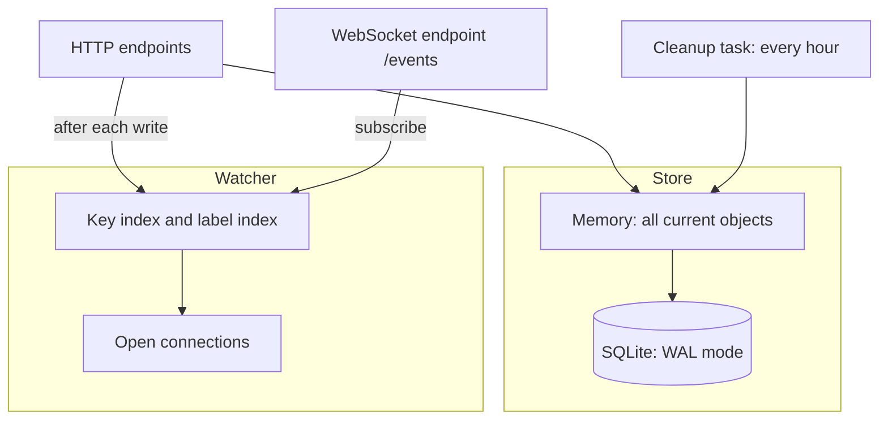
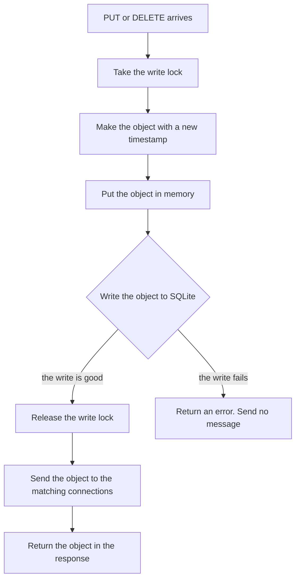
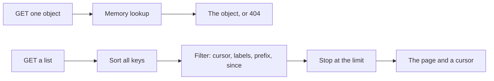
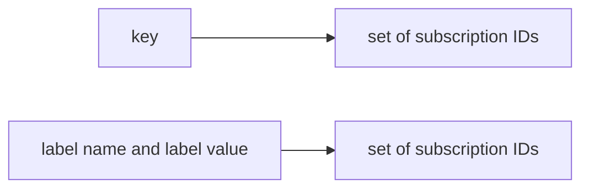
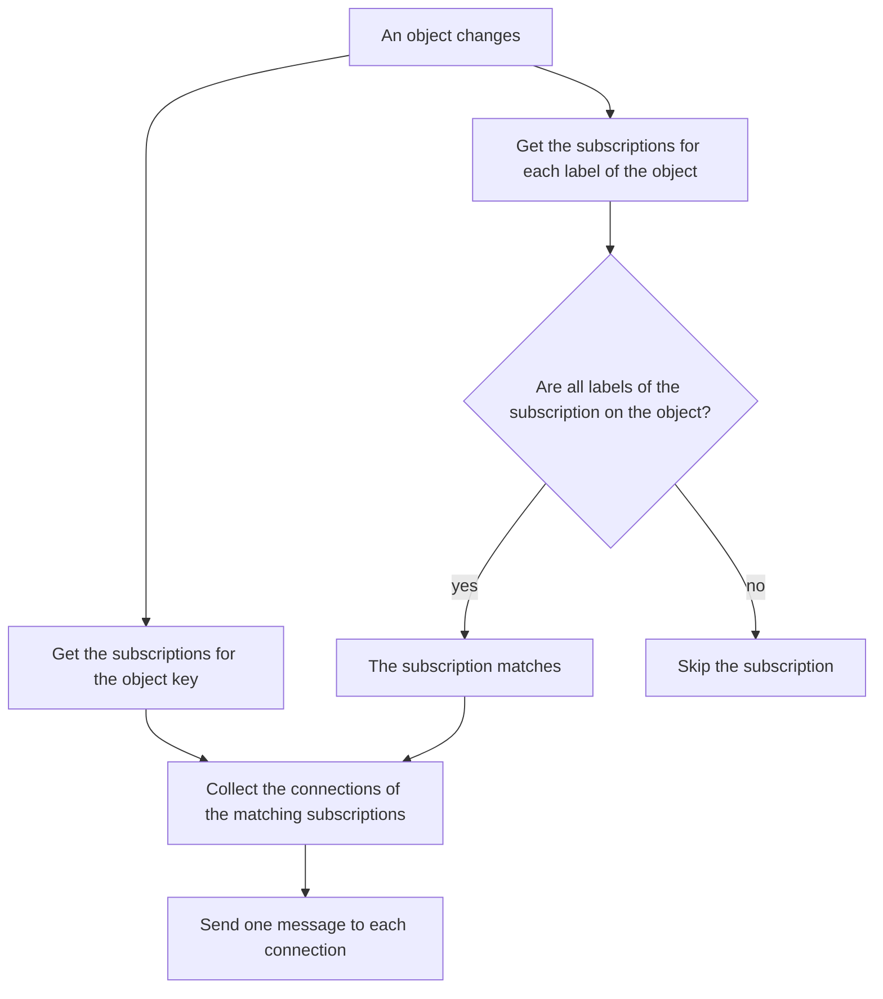
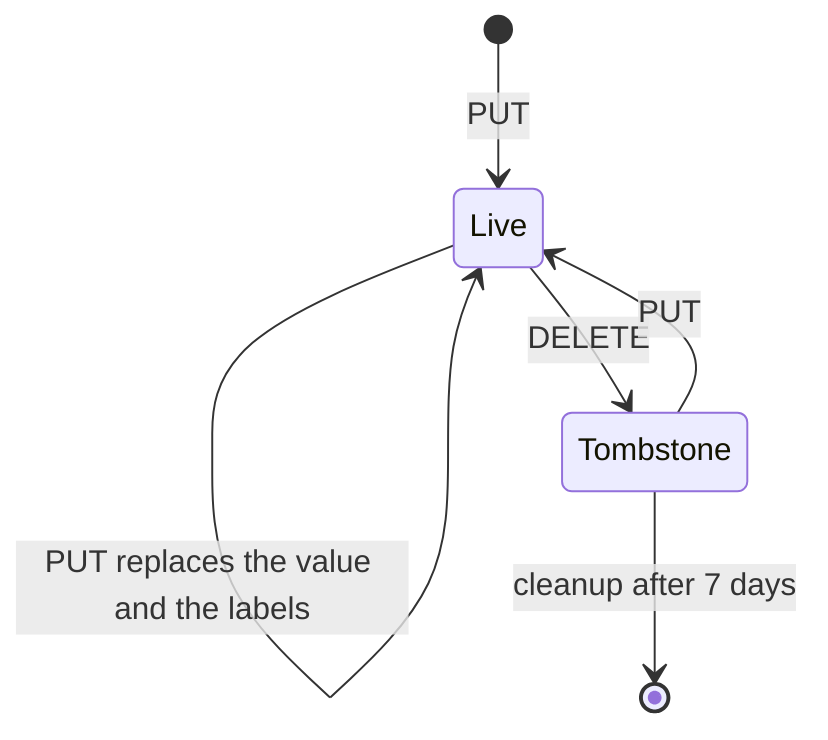
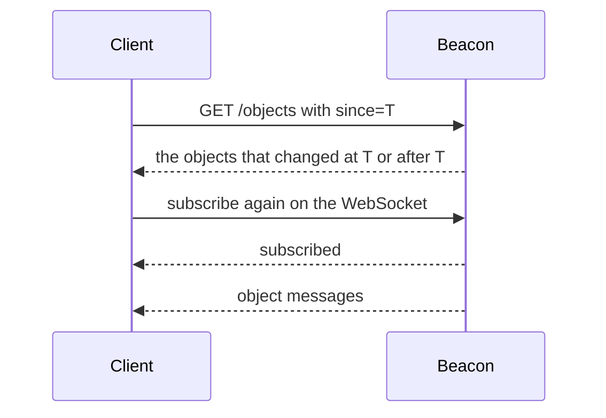

# Architecture

Beacon is one Python process with two parts: a **store** and a **watcher**. There is no cluster, no broker, and no worker process.

## Store

The store keeps two copies of the same current state:

| Copy | Purpose |
| --- | --- |
| Memory (a Python dictionary) | Fast reads, fast lists, and fast label matching. |
| SQLite (WAL mode) | Keeps the data safe across a restart. |

Beacon reads all objects from SQLite into memory at startup. After that, every read comes from memory. SQLite receives writes only.

The store has one write lock. SQLite processes one write at a time, so the lock keeps the two copies in the same order.

### Write path

Beacon changes memory **before** it writes to SQLite. If the SQLite write fails, three things happen:

1. The request returns an error.
2. Beacon sends no notification.
3. Memory holds the new object, but SQLite does not.

The two copies then differ until the next restart. A restart reads SQLite, so the failed write disappears.

### Read path

A read does not use SQLite:

`GET /objects` sorts and scans all keys in memory. The cost grows with the total number of objects, not with the size of the page.

## Watcher

One connection can hold many subscriptions. A subscription selects an exact key, or a set of labels.

The watcher keeps two indexes. Both point to subscription identifiers:

The indexes prevent a scan of all connections for each change. This is necessary at approximately 10,000 connections.

### Match path

Multiple labels always mean **AND**. There is no OR, no NOT, and no query language.

A connection receives the object one time only, even if many of its subscriptions match.

Each connection has a lock. The lock keeps the messages of one connection in order. If a send fails, Beacon does not report it. The watcher drops the message and keeps the connection.

## Object lifecycle

A `DELETE` does not remove the row. It makes a **tombstone**: `deleted` is `true` and `value` is `null`. The tombstone keeps the labels of the object, so the label watchers also receive the deletion.

A tombstone is a normal object. `GET /objects/{key}` and `GET /objects` both return it.

A background task starts one hour after startup, and then runs every hour. It removes each tombstone that is older than seven days from SQLite and from memory. A key is a `404` again after the cleanup.

## Recovery

Beacon keeps no event log. A client that misses a change reads the current state instead:

A client keeps the highest timestamp that it processed. A `subscribe` message can also include `since`. Beacon then registers the subscription first, and sends the changed objects after it.

## Guarantees

| Property | Behavior |
| --- | --- |
| Durable data | After a good write, the object is in SQLite. |
| Delivery | Best effort only. Beacon does not send a failed message again. |
| Duplicates | A client can receive the same object more than once. |
| Order | Messages to one connection stay in order. |
| Timestamps | Unix milliseconds. Two changes can share one timestamp. |
| Conflicts | The last write wins. |

## Design rules

Beacon does not have these features:

- authentication and authorization
- compare-and-swap, locks, and leases
- replication, consensus, and leader election
- an event log and event replay
- OR, NOT, and range queries

Add a feature only when a real requirement needs it. Read [AGENTS.MD](../AGENTS.MD) before you make a change.
